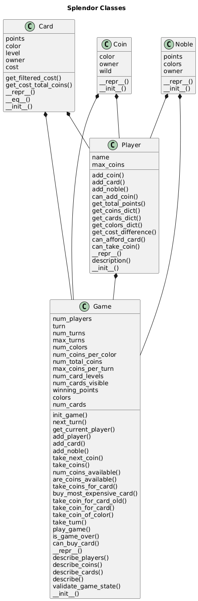
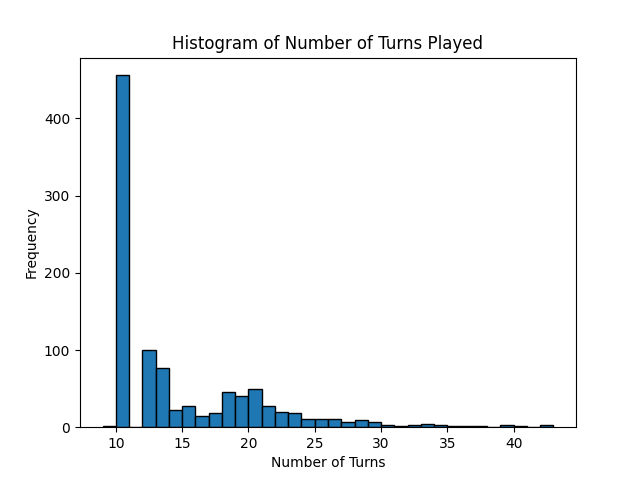
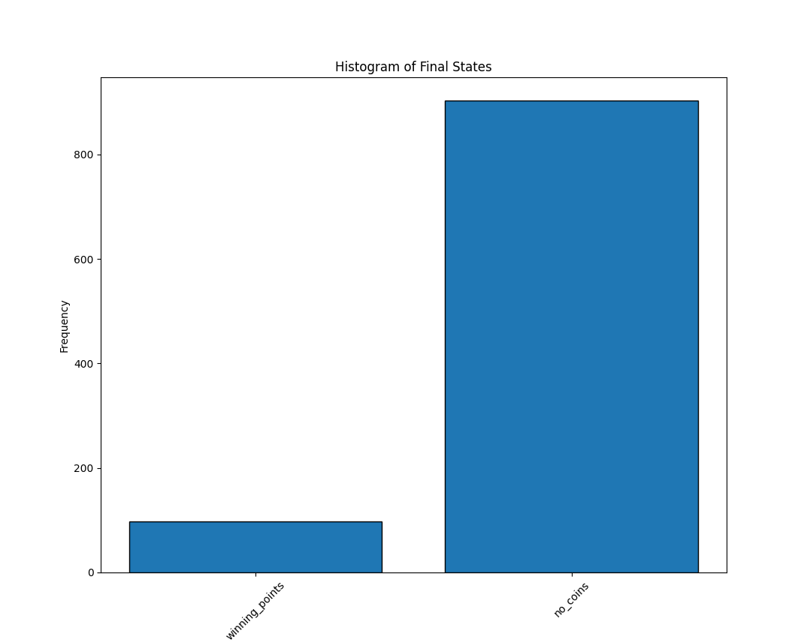

# Splendor Python Module

Welcome to the Splendor Python Module! This module is designed for experimenting with the game Splendor, a popular board game of strategy and resource management. With this module, you can simulate gameplay, test strategies, and explore various aspects of the game using Python.

## Game Rules

Splendor is a game of chip-collecting and card development. Players are merchants of the Renaissance trying to buy gem mines, means of transportation, shops—all in order to acquire the most prestige points. 

### Objective
The objective of the game is to reach 15 prestige points before your opponents.

### Setup
1. Shuffle the development cards and place them in three separate decks according to their level (I, II, III).
2. Lay out four cards from each level face up in a row.
3. Place the noble tiles above the development cards.
4. Arrange the gem tokens and gold tokens in separate piles.

### Turn Overview
On your turn, you can perform one of the following actions:
1. **Take 3 gem tokens of different colors.**
2. **Take 2 gem tokens of the same color (only if there are at least 4 tokens of that color left).**
3. **Reserve 1 development card and take 1 gold token (joker).**
4. **Purchase 1 face-up development card or a previously reserved card.**

### Purchasing Cards
To purchase a card, you must spend the required number of gem tokens. Purchased cards provide permanent gem bonuses and may also grant prestige points.

### Winning the Game
The game ends when a player reaches 15 prestige points. The player with the most prestige points at the end of that round wins the game.

For more detailed rules, please refer to the official Splendor rulebook.

## Splendor.py Module

The `Splendor.py` module is a Python implementation designed to simulate the Splendor game. This module provides various classes and functions to model the game's components and mechanics, allowing users to experiment with different strategies and gameplay scenarios.

### Features

- **Game Simulation**: Simulate complete games of Splendor, including player turns, card purchases, and point calculations.
- **Strategy Testing**: Implement and test different strategies to determine their effectiveness in various game situations.
- **Customizable Setup**: Configure the initial game setup, including the number of players, initial resources, and card distribution.
- **Detailed Logging**: Track the progress of the game with detailed logs of each player's actions and game state changes.

### Classes and Functions

- **Game**: Represents the overall game, managing the state and flow of the game.
- **Player**: Models a player in the game, including their resources, reserved cards, and actions.
- **Card**: Represents a development card, including its cost, bonuses, and prestige points.
- **Token**: Models the gem and gold tokens used in the game.
- **Noble**: Represents a noble tile, including its requirements and prestige points.

### Example Usage

```python
from Splendor import Game, Player

# Initialize a new game with 2 players
game = Game(num_players=2)

# Add players to the game
player1 = Player(name="Alice")
player2 = Player(name="Bob")
game.add_player(player1)
game.add_player(player2)

# Start the game
game.start()

# Simulate a turn for player 1
player1.take_turn(game)

# Continue the game until a player wins
while not game.is_over():
    for player in game.players:
        player.take_turn(game)

# Announce the winner
winner = game.get_winner()
print(f"The winner is {winner.name} with {winner.prestige_points} prestige points!")
```

For more detailed information on how to use the `Splendor.py` module, please refer to the module's documentation.



## Experiments

Once basic game play is established, the Splendor module can be used for running experiments.

### Limited Game Experiments

In our first round of experiments, we have not fully implemented all aspects of the game.  For these limited game experiments, we have not implemented:

   * The top level cards
   * The 'wild' gold coins
   * The ability to take two coins of the same color, rather then three of different colors
   * The ability to reservere a card

And we did implement the following rules/strategies:

   * Game is won with only one point
   * Players try to buy the first card they can afford
   * Players choose coins randomly.

Not too surprisingly, this limited game hits deadlock more often than a player winning.  About 85% of the time there are no coins left for 4 players to pick, but no one can afford a card on the table.





This doesn't teach us much, except for the fact that if players don't know what they are doing, the game can't move forward.